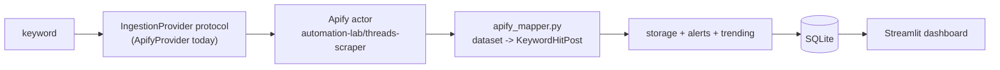

# Megu Threads Scrape

Projek Python untuk monitor public Threads account: followers, posts, engagement, breakout post, dan dashboard local.

## Architecture — swappable ingestion provider

Keyword search doesn't call the Apify actor directly. It sits behind an `IngestionProvider` protocol (`threads_intel/ingestion/__init__.py`), and `get_provider()` picks the implementation from `INGESTION_PROVIDER` in config. Today that's `ApifyProvider`, backed by the `automation-lab/threads-scraper` actor — chosen so I don't have to maintain a Threads browser-automation stack myself. Swapping in a different source (a self-hosted scraper, another vendor) means implementing one method, `ingest_keyword()`; the pipeline, storage, alerts, and dashboard never change.



## Cara install di Linux Mint

```bash
sudo apt update
sudo apt install -y python3 python3-venv git curl sqlite3
curl -LsSf https://astral.sh/uv/install.sh | sh
source ~/.bashrc

cd ~
unzip bebenang_intel.zip
cd bebenang_intel
uv sync
cp .env.example .env
```

> **Quick start note:** profile monitoring (`fetch` / `summary` / Telegram bot) works with just the steps above. Keyword search needs one more thing — an `APIFY_TOKEN` in `.env` — see [Keyword search (Apify)](#keyword-search-apify) below.

## Run CLI

```bash
uv run bebenang fetch akmalrahim --limit 20
uv run bebenang fetch mydinmalaysia --limit 20
uv run bebenang list akmalrahim
uv run bebenang summary akmalrahim
```

## Run dashboard

```bash
uv run streamlit run threads_intel/dashboard.py
```

Buka URL yang Streamlit beri, biasanya `http://localhost:8501`.

## Hantar summary ke Telegram

1. Create bot di BotFather.
2. Masukkan token dan chat id dalam `.env`.
3. Run:

```bash
uv run bebenang telegram-summary akmalrahim
```

## Telegram bot interaktif

Masukkan secret dalam `.env`:

```env
TELEGRAM_BOT_TOKEN=token_dari_botfather
OPENAI_API_KEY=optional_untuk_ai_analysis
OPENAI_MODEL=gpt-5.4-mini
```

Run bot:

```bash
uv run bebenang telegram-bot
```

Dalam Telegram, hantar salah satu:

```text
ahmadafif5321
https://www.threads.com/@ahmadafif5321
/fetch ahmadafif5321
/summary ahmadafif5321
/analyze ahmadafif5321
```

Bot akan fetch profile, simpan data, dan balas score, details engagement, top 3 hooks, serta link Threads. `/analyze` perlukan `OPENAI_API_KEY`.

## Keyword search (Apify)

Keyword ingestion guna [automation-lab/threads-scraper](https://apify.com/automation-lab/threads-scraper) Apify actor.

Setup:
1. Buat akaun di [apify.com](https://apify.com) dan dapat API token dari console.
2. Masukkan token dalam `.env`:

```env
APIFY_TOKEN=apify_api_xxxxxxxxxxxx
APIFY_ACTOR_ID=automation-lab/threads-scraper
INGESTION_PROVIDER=apify
SEARCH_KEYWORDS=ai,malaysia,startup
```

Run keyword search:

```bash
uv run bebenang search "artificial intelligence" --target 500
uv run bebenang keyword-report "artificial intelligence"
```

Run semua keywords sekaligus (ingestion + alerts):

```bash
uv run bebenang search-cron
```

Keyword tab dalam dashboard (`uv run streamlit run threads_intel/dashboard.py`) menunjukkan trend series, viral hooks, influencer ranking, dan coverage/budget status.

**Nota vendor:** `automation-lab/threads-scraper` adalah third-party Apify actor. Semak Terms of Service actor dan polisi Apify sebelum guna dalam production. Field mapping dalam `apify_mapper.py` perlu disahkan dengan satu sample run sebenar (lihat TODO dalam fail tersebut).

## Telegram bot — keyword command

Bot interaktif menyokong command `/keyword`:

```text
/keyword artificial intelligence
/keyword malaysia
```

Bot akan balas dengan top viral hooks, trend series (3 run terkini), dan top influencers untuk keyword tersebut.

## Alerts

Alert rules disimpan dalam `alert_rules` table. Dua condition disokong:

- `volume_spike` — fire bila latest run volume >= X% di atas prior window average
- `breakout` — fire bila total engagement dalam latest run >= threshold

Alert dihantar ke Telegram via `TELEGRAM_BOT_TOKEN` + `TELEGRAM_CHAT_ID`. Alerts dievaluate secara automatik selepas setiap `search-cron` run.

## Cron harian contoh

```bash
crontab -e
```

Tambah (profile fetch):

```cron
0 8 * * * cd /home/$USER/bebenang_intel && uv run bebenang fetch akmalrahim --limit 30 && uv run bebenang telegram-summary akmalrahim
```

Tambah (keyword ingestion + alerts, setiap 6 jam):

```cron
0 */6 * * * cd /home/$USER/bebenang_intel && uv run bebenang search-cron
```

Atau guna Python scheduler secara terus:

```cron
0 */6 * * * cd /home/$USER/bebenang_intel && uv run python -m threads_intel.scheduler
```

## Nota penting

Scraper ini baca data public page sahaja. Jangan guna untuk private account, jangan spam request, jangan bypass login/captcha, dan jangan gunakan data untuk ganggu orang. Public web structure Threads boleh berubah; kalau Meta ubah HTML/JSON, parser perlu patch.

`APIFY_TOKEN` mengandungi credentials — jangan commit ke git. Fail `.env` sudah dalam `.gitignore`.
